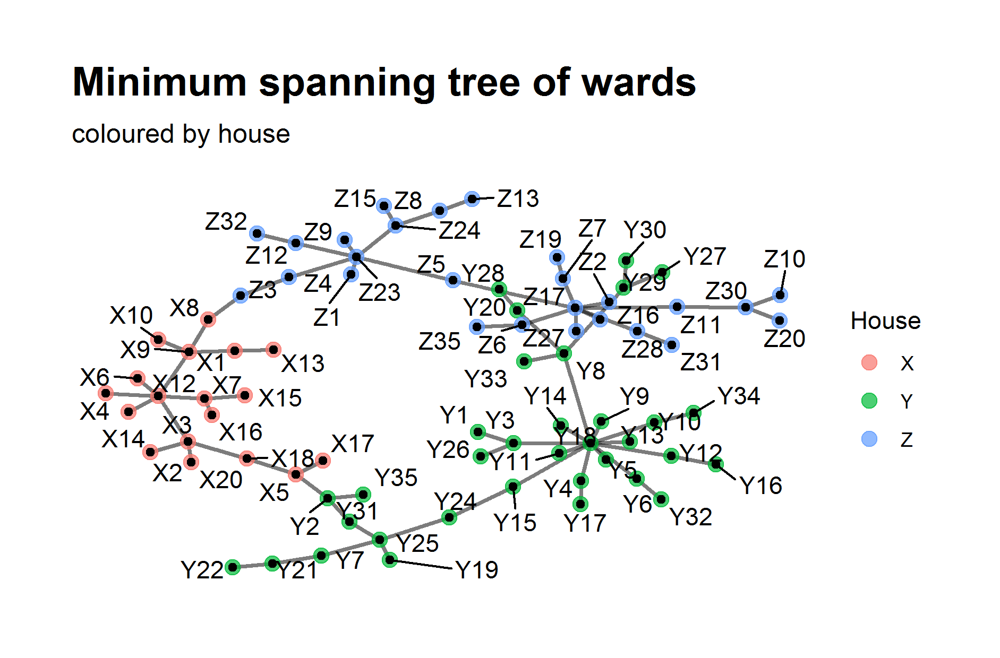
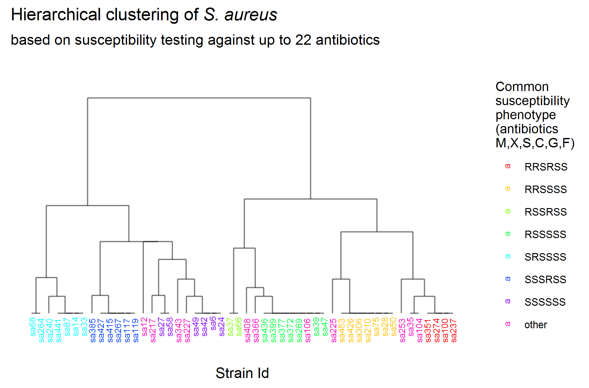
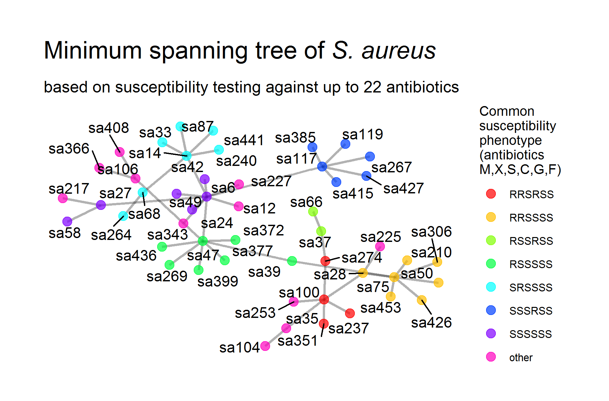

# yea13
This R-package attempts to implement the algorithm by [**Y**pma **e**t **a**l. 20**13**](https://www.ncbi.nlm.nih.gov/pubmed/23922835) with the goal of identifying putative clusters in surveillance datasets.

## Installation
Make sure you have [R](https://www.r-project.org/) and package [devtools](https://cran.r-project.org/web/packages/devtools/index.html) installed. Then, type `devtools::install_github("joheli/yea13")` to install package ‘yea13’.

## Data
Surveillance data (`s_aureus`, `k_pneumoniae`, `e_cloacae`) were supplied by a microbiology lab serving a hospital trust. Column names `id`, `time`, and `unit` were altered on data protection grounds. Network data (`units_igraph`) represent a snapshot of connections between units (wards) of said hospital trust with unit names altered as above (see `?units_igraph` for information). Effective distances (`units_effdist`) were calculated from `units_igraph` using function `graph2effdist.r`.

## The principle

Ypma et al. suggest calculating spatial, genetic, and temporal dissimilarities between occurrences and then multiplying them. The thus generated dissimilarity (henceforth referred to as 'Ypma dissimilarity') is then used to search for clusters, i.e. cases with unusually low dissimilarities between them.

### Spatial dissimilarity

From a graph of units (wards) a matrix of 'effective distances' is calculated using package `NetOrigin` (also available on [github](https://github.com/jmanitz/NetOrigin)). The matrix is used to create a minimum spanning tree between units. Finally. the number of nodes between nodes in the minimum spanning tree represent the spatial dissimilarities:

### Genetic dissimilarity

For the 'genetic' dissimilarity susceptibility data (as opposed to data from true genetic typing) were exported into data frames `s_aureus`, `k_pneumoniae`, and `e_cloacae`. This was done out of convenience, as genetic typing was not available for the supplying laboratory. Nevertheless, the workup is comparable to genetic data (e.g. DNA sequences), although for e.g. whole genome multi-locus-sequence-typing (MLST) the dissimilarities would have to be calculated slightly differently than for susceptibility data (I would suggest `cluster::daisy` with metric `gower` to this end). 
Be it as it may, the first step is the creation of a distance matrix (visualized by the hierarchical clustering above), which is translated into a minimum spanning tree; as with the spatial dimension above, the number of nodes between nodes represent genetic dissimilarities.

### Temporal dissimilarity

Compared to above dissimilarities the temporal one is fairly easy to calculate; the steps are similar: first, a distance matrix is generated, from which a minimum spanning tree (a linear one without branches) is calculated. The rest is as above!

### Combining spatial, genetic and temporal dissimilarities to 'Ypma dissimilarities'

Multiplication of above dissimilarities creates a matrix of 'Ypma dissimilarities' which are evaluated for the presence of significantly low distances by means of permutation.

## Let's start already

This package is very much in development and probably full of bugs, so please use it at your own risk. Nevertheless, if you're eager to start, install this package and start with function `cluster.search`. Read the manual by entering `?cluster.search` into the R-console.

### References

* Ypma RJ, Donker T, van Ballegooijen WM, Wallinga J. Finding evidence for local transmission of contagious disease in molecular epidemiological datasets. PLoS One. 2013 Jul 26;8(7):e69875.
