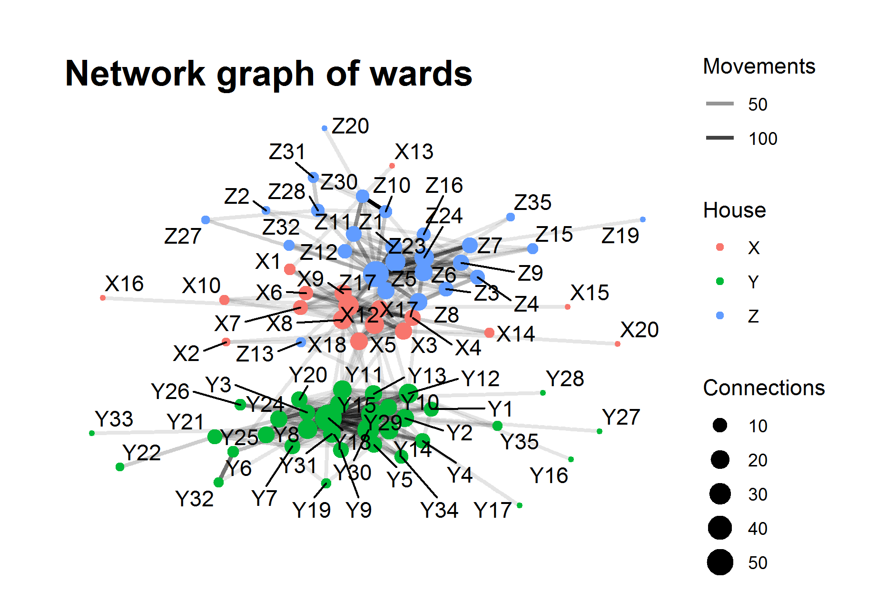
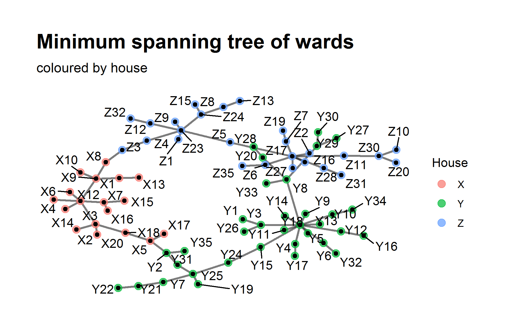
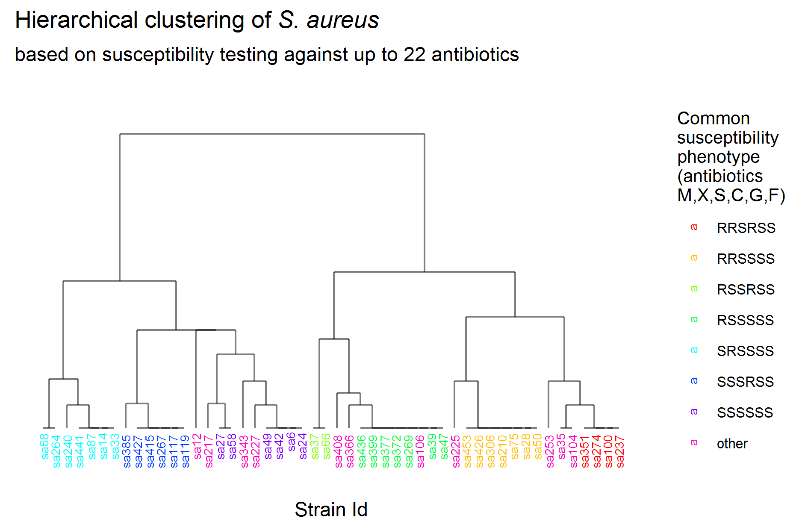
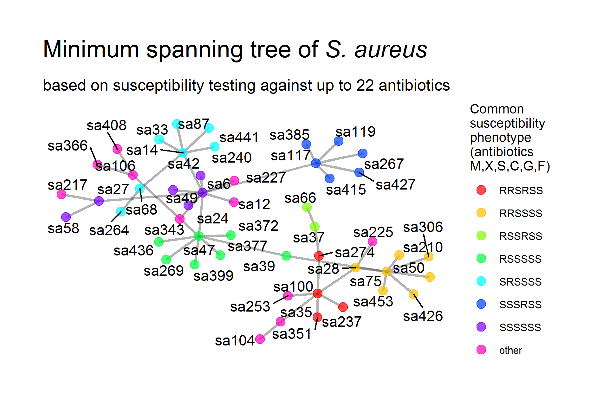

# yea13

This R package implements the algorithm described by [**Y**pma **e**t **a**l. 20**13**](https://pubmed.ncbi.nlm.nih.gov/23922835/) with the goal of identifying putative clusters in surveillance datasets.

> ⚠️ **Project status: Dormant / Seeking contributors**  
> The package has recently been refreshed for R 4.5, but the epidemiological/statistical behaviour should still be validated on additional datasets. A Python reimplementation remains on the roadmap.

## What the package does

Ypma et al. combine spatial, genetic/type, and temporal dissimilarity. In `yea13`, each component is converted to a minimum-spanning-tree hop distance. The three hop-distance matrices are multiplied to form the "Ypma dissimilarity". Hierarchical clustering proposes candidate groups, while permutations provide a reference distribution for unusually small within-cluster dissimilarities.

The main entry point is `cluster.search()`. Lower-level functions such as `ypma.diss()`, `diss()`, `mst()`, and `y.clust()` are useful for inspecting individual stages.

## Installation

The modernized package requires R >= 4.5.0. From the repository root you can install the checked-out source with:

```r
install.packages("remotes")
remotes::install_local(".", dependencies = TRUE)
```

To install directly from github:

```r
remotes::install_github("joheli/yea13")
```

## Quick start with Docker

The Docker image uses R 4.5.1 and installs the local checkout, so changes made in the repository are actually tested rather than reinstalling `master` from GitHub.

```bash
docker compose build --no-cache
docker compose run --rm -it yea13
```

Then in R:

```r
library(yea13)
?cluster.search
```

### Explore the datasets

You could e.g. do:

```r
# set seed to make reproducible
set.seed(3)
# search clusters within dataset for E. cloacae, specifying a high p-value of 0.4:
test_ec <- cluster.search(e_cloacae, e = units_effdist, tc = "time", uc = "unit", ic = "id", p.n = 100, hs= c(2,3,6), dfun = "dist", dfun.args = list(method = "manhattan"), p.value = 0.4, n.cores = 1)
# In the resulting data frame `test_ec` column sig0 labels those clusters that have a very low
# max. dissimilarity (none) and sig1 labels those clusters that have a p-value below 0.4 (3 clusters).
```


## Running the tests

From an R session opened in the repository:

```r
install.packages(c("devtools", "testthat"))
devtools::test()
devtools::check()
```

`devtools::test()` is the quick unit-test loop. `devtools::check()` is the more complete package check and is the one to run before merging or releasing. The repository also contains a GitHub Actions workflow that runs `R CMD check` with R 4.5.1.

Without `devtools`, the equivalent command-line workflow is:

```bash
R CMD build .
R CMD check yea13_*.tar.gz
```

## Data

Surveillance data (`s_aureus`, `k_pneumoniae`, `e_cloacae`) were supplied by a microbiology lab serving a hospital trust. Column names `id`, `time`, and `unit` were altered on data protection grounds. Network data (`units_igraph`) represent a snapshot of connections between units (wards) of said hospital trust with unit names altered as above (see `?units_igraph`). Effective distances (`units_effdist`) were calculated from `units_igraph` using `graph2effdist()`.

## The principle

Ypma et al. suggest calculating spatial, genetic, and temporal dissimilarities between occurrences and then multiplying them. The resulting dissimilarity is evaluated for cases with unusually low dissimilarities between them.

### Spatial dissimilarity



From a graph of units (wards), a matrix of effective distances is calculated using package `NetOrigin`. The matrix is used to create a minimum spanning tree between units. The number of edges (hops) between nodes in that tree represents the spatial dissimilarity.



### Genetic/type dissimilarity



For the type/genetic component, the included example datasets use antimicrobial susceptibility data because genetic typing was not available from the supplying laboratory. The same workflow can be applied to suitable genetic distances. For mixed or categorical typing data, `cluster::daisy()` with Gower distance may be appropriate.

The type-distance matrix is translated into a minimum spanning tree; again, hop counts in the tree are used as dissimilarities.



### Temporal dissimilarity

Temporal distances are calculated from observation times, converted to a minimum spanning tree, and then to hop distances in the same way.

### Combining the components

Multiplication of the spatial, type/genetic, and temporal hop-distance matrices creates the Ypma dissimilarity matrix. Candidate clusters are then compared with permuted data to identify unusually tight groups.

## Roadmap

- [ ] Validate statistical behaviour on a prospective dataset
- [ ] Expand tests around permutation and end-to-end cluster detection
- [ ] Python reimplementation (NumPy/SciPy permutations, optional Rust via PyO3)
- [ ] medRxiv preprint

## Reference

Ypma RJ, Donker T, van Ballegooijen WM, Wallinga J. Finding evidence for local transmission of contagious disease in molecular epidemiological datasets. *PLoS One*. 2013;8(7):e69875. doi:10.1371/journal.pone.0069875.
